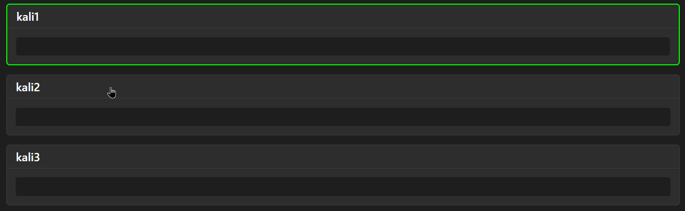
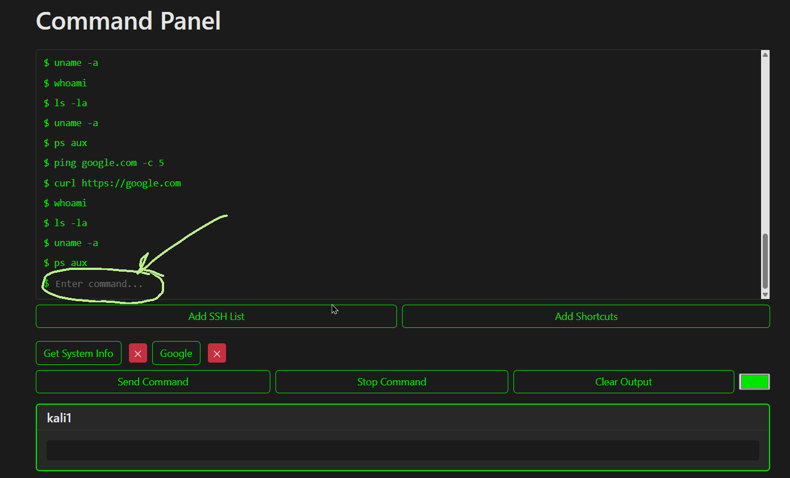
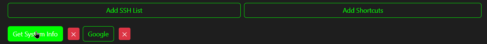

# FriendlyBotnet

Friendly Botnet to deal with multiple machines using SSH protocol.

## Installation

Activate the virtual environment:

```bash
cd FriendlyBotnet && python -m venv venv

source venv/bin/activate # On Linux
venv\Scripts\activate # On Windows
```

## Usage

Install Docker and build test containers
```bash
# skip on Windows, just start the Docker Engine app
sudo systemctl start docker.service
docker-compose up -d
```

Run the app
```bash
python manage.py runserver
```
First add SSH list of connections to your machines (in test case for docker containers, just copy it from containers.txt file)
You can run commands on selected containers (unselect them by clicking on the container card)

Paste your command here and click enter, or press start command

You can add shortcuts (a sequence of commands) and run them by clicking on the buttons



## Contributing

Pull requests are welcome. For major changes, please open an issue first
to discuss what you would like to change.

Please make sure to update tests as appropriate.

## License
[MIT](https://choosealicense.com/licenses/mit/)